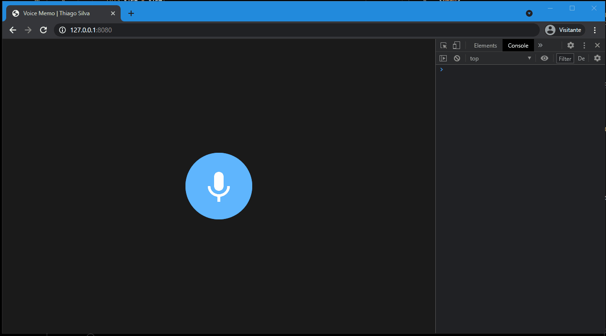

# Voice Memo App Using HTML5, Media Recorder and getUserMedia APIs

This is a web record app made with ECMAScript Modules and Browser native Web apis. The app aims to record the users's audio stream by using the Web Api **MediaRecorder**, obtaining the recorded data using the MediaDevices api.

## Project Status

This project is just a personal showcase, done with de aim of register what i have studied, and show my skills. It may receives improvements in the future.

## Running

`npm ci && npm start`

## Demo

| When you click start recording it'll record your voice and then play it |
| ----------------------------------------------------------------------- |
|                                                        |

## Credits

- Layout got from [Ettrics' CodePen](https://codepen.io/ettrics/pen/KpzzQZ)